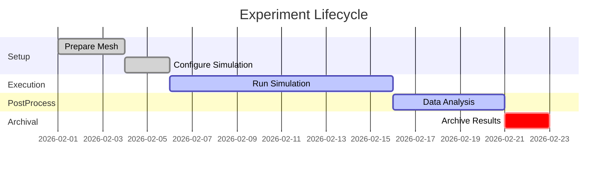

# OpenFOAM Development Best Practices

## Executive Summary
This report presents comprehensive best practices for developing OpenFOAM projects, covering logging, experiment tracking, task management, planning, code structure, pipelines, data management, performance, validation, collaboration, documentation, licensing, security, and workspace workflows. Key recommendations include structured logging and run-tracking, leveraging existing tools (e.g. DVC, Docker, spdlog) and built-in OpenFOAM utilities (e.g. foamLog). We advise systematic task and issue templates (bug/feature forms) and code TODO lists to clarify work. For planning, use Agile methods (sprints, milestones, Gantt charts) to organize deliverables. Repositories should separate cases (with 0/, constant/, system/ folders) from code (custom solvers/libraries in applications/ and src/).

Robust CI/CD pipelines (e.g. GitHub Actions, Jenkins, GitLab CI) should automate builds, static analysis, unit/integration tests, and regression checks (OpenFOAM's Code Quality Guide mandates tests be included for new features [60:L132-L136]). Use frameworks like Catch2/foamUT for unit tests and the OpenFOAM Benchmark Runner (OBR) for larger regressions [9:L25-L33]. Version-control large files with Git LFS or DVC [26:L269-L272][56:L1-L4] and archive old cases. Profile performance using timers, gprof/perf, and HPC tools to identify bottlenecks.

Ensure verification and validation via convergence studies, analytic cases, and comparison to literature/experimental data. Follow the OpenFOAM Code and Style Guides: e.g. 80-char lines, 4-space indent, no tabs/trailing spaces [61:L1-L4], use OpenFOAM's container classes, and conform to API conventions [60:L150-L156]. Collaborate via git branching (feature branches or GitFlow), PR templates, and code reviews to maintain quality. Write thorough README and tutorials; use Doxygen or markdown docs. License releases (GPLv3) and publish changelogs. Manage dependencies (via Docker/Conda) and apply security scanning. For AI/Codex workflows, maintain assumption logs, structured task lists, and clear agents roles.

Actionable Checklist: follow step-by-step checklists below for implementation, from setting up logging and version control to releasing code. These practices, drawn from official OpenFOAM documentation [60:L132-L136][60:L150-L156] and community resources [56:L1-L4][45:L88-L97], ensure reproducibility, quality, and collaboration.

---

## Session Logging and Experiment Tracking
What to log: Record all simulation runs and development sessions. For OpenFOAM runs, redirect console output to log files (e.g. simpleFoam > log.simpleFoam). Include solver iterations, residuals, Courant numbers, runtime, and any errors. Use foamLog (an OpenFOAM utility) to parse log.* files into XY data for residuals or force history [39:L0-L3]. Also log environment details: OpenFOAM version, Git commit hash, OS, compiler flags, machine/node name, and input parameters (e.g. case settings, mesh sizes).

Log format: Use structured, timestamped entries. Wherever possible, log in JSON or CSV format to facilitate parsing [45:L88-L97]. For example, write JSON lines with fields like "time":"2026-02-01T12:34Z","level":"INFO","component":"solver","message":"iteration 100, residual 1.2e-05". Include context fields (timestamp, log level, component name, unique run ID or correlation ID) [45:L118-L127]. Avoid verbose debug info unless needed. Keep logs focused on key events (start/stop, errors) to avoid noise [45:L162-L165]. For long simulations, consider checkpointing: use OpenFOAM's ability to write fields at intervals (via writeInterval in controlDict) and record checkpoints so that runs can be resumed and audited.

Automated logging tools: Integrate logging frameworks if adding new C++ code. Popular C++ libraries include spdlog (fast, header-only) or Boost.Log for detailed logging. For example, spdlog supports JSON formatting and asynchronous logging for high performance. Alternatively, use OpenFOAM's existing logging (which prints to console). On HPC systems, capture job scheduler logs (SLURM/LSF) which record resource usage and stdout. Consider central log aggregation (e.g. ELK stack or DataDog) for multi-machine runs. The overall goal is that every important event or metric is logged, and logs are versioned with the experiment for auditability.

Run/Experiment tracking: Assign each simulation run a unique ID (e.g. timestamp + short hash). Maintain a manifest file (YAML/JSON) recording metadata: solver name, case description, parameters (Reynolds number, mesh size, boundary conditions, user, date, git commit). Tools like DVC can track data and code versions together [56:L1-L4]. For example, use DVC to version output directories (fields, images) in a remote storage (on-prem or S3) and link them to a specific Git commit [56:L1-L4]. Alternatively, use experiment tracking tools (MLflow, Weights and Biases) to log parameters, metrics (e.g. convergence rates, drag coefficients), and attach raw output files. Always archive input files (mesh, constant/, system/, boundary conditions) so runs are fully reproducible. Store run logs, scripts, and final results in a structured way (see Data Management below).

Examples: A run script (run.sh) can combine logging and tracking. For instance, in the TRC-HPC/OpenFOAM-HPC example, each case has a run.sh that untars large mesh files, runs decomposePar, and then executes caaFOAM > log.caaFOAM [26:L269-L272][26:L280-L288]. That script can echo the run ID, start/end timestamps, and solver info to a results summary file. Use variables like $WM_PROJECT_VERSION (OpenFOAM version) in the log. Include a copy of input controlDict and notes on changes to track exactly what was run.

## TODOs and Issue Templates
Use TODO lists and issue templates to organize development tasks. In code files or a TODO.md, list open tasks with context. For example, a TODO.md could require each entry to include Why, History, and What (as in the provided workspace) for clarity. In GitHub/GitLab, define issue templates (.github/ISSUE_TEMPLATE/) for Bug Reports and Feature Requests. A bug template might have fields:

- Description: Clear description of the bug.
- Steps to reproduce: Exact steps (commands, case details) to see the bug.
- Expected behavior: What should happen.
- Actual behavior: What happens instead (include error messages).
- Environment: OpenFOAM version, compiler, OS, case used.

A feature request template could prompt: Summary of proposed feature, Use case, Alternatives considered, Impact. Provide sections or bullet points as guidance. For example:

```
Bug Report
Case/Solver: [e.g. incompressible/simpleFoam]
OpenFOAM version: [e.g. v2406]
Description: [What did you expect? What happened?]
Steps to reproduce:
1. run blockMesh on tutorial channelFoam case
2. run simpleFoam with xyz
3. error: Floating point exception
Expected result: [e.g. Simulation converges without crash]
Actual result: [e.g. Crash with stack trace...]
```

Use GitLab's or GitHub's issue forms (YAML) if available, to make these structured. GitHub Docs note: issue templates can auto-assign labels and provide checklists [47:L129-L137]. You can also create a PR template requiring a checklist (e.g. code compiles, tests pass, documentation updated).

For in-code TODOs, use a consistent tag (e.g. // TODO:) and consider automated reminders (linters can catch unaddressed TODOs). Also maintain a backlog file (e.g. questions_backlog.md) where incomplete questions or tasks are recorded. This keeps goals visible.

## Project Planning and Milestones
Adopt a project management process. Use Agile sprints or Kanban boards to set short-term goals and deliverables. Define milestones (e.g. v0.1: Basic solver implemented, v1.0: First simulation results validated, v2.0: Performance optimized) with dates. Tools like GitHub Milestones, Jira, or Trello can track issues/features per milestone. Break work into tasks (some labeled S0, S1 in the workspace example) with owners and deadlines.

A timeline or Gantt chart helps visualize phases (e.g. planning, development, testing, analysis). For example, a Gantt in Mermaid might show:



These timelines (like the example chart above) make stages clear. Periodically hold sprint reviews to assess progress and update plans. Use version-control branch names or Git tags to correspond to milestones.

## Code Organization and Repository Structure
Organize the repo to separate case data from code. A common structure:

- applications/solvers/: custom solvers
- applications/utilities/: utilities
- src/: custom libraries or modules (with subfolders for each library)
- cases/ or tutorials/: example cases (each case in its own folder with 0/, constant/, system/)
- tests/: integration/regression test cases
- docs/: documentation and tutorials
- scripts/: helper scripts (run scripts, data processing)
- data/: reference data sets (if small)
- Dockerfile or conda/: environment specs
- README.md, LICENSE, CHANGELOG.md, etc.

This mirrors the OpenFOAM project layout (e.g., $FOAM_APP/ and $FOAM_SRC), but in your repo. For solvers compiled with wmake, include Make/files alongside source. Place all necessary cases in version control if feasible (use Git LFS if large). The TRC-HPC example stores small cases in repo and uses git-lfs for ~80M-cell meshes [26:L269-L272].

Within case folders, follow OpenFOAM norms:
- The 0/ directory holds initial field files.
- constant/ holds mesh (polyMesh/) and physical constants.
- system/ holds control settings (controlDict, fvSchemes, fvSolution).

Keep system/ files parametric (use run scripts or Python to edit) so that runs are reproducible from a template rather than edited in place.

For code, follow OpenFOAM C++ coding guidelines [61:L1-L4] and code conventions [60:L150-L156]. Organize classes logically: e.g. if adding a library for multiphase flow, put it under src/multiphase/. Avoid monolithic files - break by functionality. Include a top-level README.md that explains repository structure and how to build/run the code.

## Build/Test/Deploy Pipelines (CI/CD)
Automate building and testing. Popular CI services include GitHub Actions, GitLab CI/CD, Jenkins, CircleCI, Travis CI, Azure Pipelines, etc. (e.g. GitHub Actions: native CI/CD for GitHub, free for OSS (2000 min) [41:L51-L59]; Jenkins: self-hosted with 1,800+ plugins [43:L1-L4]). Choose one (or more) based on your environment: for GitHub repos, Actions is convenient; for on-prem servers, Jenkins or GitLab runners may fit.

CI pipeline example: On each commit/PR, run a pipeline such as:
1. Static code checks: e.g. wmake compile, clang-format/lint, OpenFOAM's checkMesh on test cases. (OpenFOAM provides a pre-commit hook for style [10:L152-L156].)
2. Build: Compile solvers/libraries (using Allwmake or wmake).
3. Unit tests: If using Catch2/foamUT, compile and run unit tests.
4. Integration tests: Run quick OpenFOAM cases (e.g. a minimal tutorial) and verify successful completion or compare key output to reference.
5. Regression tests: Use the OpenFOAM Benchmark Runner (OBR) or custom scripts to run validated cases and diff outputs.
6. Deployment/Packaging: Optionally package executables or Docker images.

Errors or failures should be flagged immediately. For example, push to GitHub can trigger Actions that build in a container or VM, run scripts, and report status.

CI tools comparison (table): The table below highlights key CI options:

| Service              | Hosting                     | Highlights/Trade-offs                            | Notes (2026) |
|----------------------|-----------------------------|--------------------------------------------------|--------------|
| GitHub Actions       | Cloud/any (Docker runners)  | Native GitHub integration; free for OSS (2000 min) [41:L51-L59]; easy YAML setup. | Best for GitHub repos; limited build minutes on free plan. |
| GitLab CI/CD         | GitLab-hosted or self-hosted | Full DevOps suite; built-in GitLab integration.  | Good if using GitLab (hosted or on-prem); generous free tier. |
| Jenkins              | Self-hosted (on-prem)       | Highly customizable; ~1800 plugins [43:L1-L4]; no vendor lock-in. | Great for complex, enterprise pipelines; requires maintenance. |
| CircleCI             | Cloud/Self-hosted           | Easy parallelism; free for OSS; quick caching.   | Quick setup for GitHub/GitLab; parallel matrix builds. |
| Travis CI            | Cloud                       | Simple for OSS GitHub projects; YAML-based config. | Free for open source; limited concurrency. |
| Azure Pipelines      | Cloud/On-prem (Agent)       | Integrated with Azure DevOps; supports multi-platform. | Good if using Azure; generous free tier for Microsoft ecosystem. |
| Others (Bitbucket Pipelines, TeamCity, etc.) | Evaluate per project needs. | | |

CI examples: In GitHub Actions, you might use a .github/workflows/ci.yml like:

```yaml
on: [push,pull_request]
jobs:
  build_and_test:
    runs-on: ubuntu-latest
    steps:
      - uses: actions/checkout@v3
      - name: Setup OpenFOAM
        run: |
          git clone https://github.com/OpenFOAM/OpenFOAM-10.git
          cd OpenFOAM-10 && ./Allwmake -j $(nproc)
      - name: Run checkMesh on tutorial case
        run: |
          cd tutorials/incompressible/icoFoam/cavity
          blockMesh && icoFoam > log.icoFoam
      - name: Run foamUT unit tests
        run: |
          cd path/to/foamUT/tests
          make && ./testBinary --all
```

For Jenkins, use a Jenkinsfile (see [42] for example pipeline syntax). Always cache builds (e.g. wmake output) and case decompositions to speed CI.

## Data Management (Case I/O and Archiving)
OpenFOAM simulations produce large data. Manage this systematically:

- Version large files: Use Git LFS or DVC for meshes and outputs. For example, the TRC-HPC repo stores very large mesh files (>80M cells) with Git LFS [26:L269-L272] so the main repo is not bloated. Alternatively, use DVC to track large postProcessing/ or field directories without putting them in Git. DVC can push these to cloud storage (AWS S3, Google Cloud, etc.) [63:L25-L33][56:L1-L4].

- Storage options comparison: See table below for data storage trade-offs:

  | Option                              | Pros                                | Cons                                   |
  |-------------------------------------|-------------------------------------|----------------------------------------|
  | Git LFS                             | Simple, integrates with Git; good for moderate-size binaries. | Max file size limits on free hosts; versioning costs storage. |
  | DVC + Cloud (S3, GCS, Azure)        | Scalable to TB/PB; version control of data; can use on-prem object store. | Requires setup; egress costs if cloud; learning curve. |
  | HPC Filesystem (NFS/GPFS)           | Fast I/O on cluster; no per-file size limit. | Not versioned; data may be ephemeral unless archived; sharing limited to cluster. |
  | Data repositories (Zenodo/Dryad)    | Good for published data; immutable DOI; discoverable. | Not for active development (archive only); upload limits. |
  | Shared drives (NAS, etc.)           | Easy for collaboration; can sync.   | Hard to version; backups needed; limited access control. |

- Archiving: After runs, compress or archive old cases. Use tar (as in TRC-HPC's run.sh, which untars heavy mesh files on demand [26:L280-L288]). Store archives in a long-term storage or object store. Clean up intermediate data not needed for final analysis (e.g. only save final time steps or processed data).

- Data provenance: Always save the exact input files for each run. If running parametric sweeps, store parameter lists and scripts. For analysis and visualization data (e.g. plot files, Paraview states), keep those in a structured way (e.g. /data/ directory or DVC-tracked). Include a manifest (or code) that records which source files generated which outputs.

## Performance Profiling and Benchmarking
Measure and optimize performance:

- Profiling tools: Instrument code with timers (Pstream::clock() or Info<< "Timer ..." << endl), or use system profilers. For C++ solver code, tools like gprof, perf, or Intel VTune can find hotspots. MPI/parallel profiling tools (Score-P, Scalasca, Tau) help with scalability. Also use OpenFOAM's built-in timing (enable functions { reportTimes true } in controlDict).

- Benchmarking: Establish baseline cases to test performance. Run on different core counts to check scaling. Automate this (for example, using OBR frameworks or custom scripts). Record results (execution time, memory) and track regressions over time. Example: measure wall-clock time for a standard tutorial with 4, 8, 16 cores and plot scaling efficiency.

- Hardware considerations: If relevant, leverage GPUs or specialized solvers (see OpenFOAM GPU efforts). Document hardware (CPU type, memory) and MPI settings. Use environment variables (e.g. export OMP_NUM_THREADS, mpirun flags) and log them.

- Charting: It is useful to plot typical run metrics. For instance, generate a time-series chart of residual vs. iteration, or a bar chart of runtimes for different mesh sizes. A Mermaid-style example (flow chart or sequence) can illustrate the experiment phases (see Gantt chart in Planning).

## Validation and Verification (V and V)
Ensure the solver code is correct and results are credible:

- Verification: Check that the code solves the equations correctly. Perform mesh refinement (grid convergence) studies and compare to analytical or manufactured solutions if possible. For example, verify diffusion solver by solving a problem with known solution. Use OpenFOAM's checkMesh to ensure mesh quality. Validate conservation (mass, momentum) from logs. For new solvers/models, start with simple cases (e.g. unit cube with Dirichlet boundaries) to verify basic behavior.

- Validation: Compare simulation results to experimental or high-fidelity data. Use standard benchmark cases (e.g. flow over a cylinder, channel flow, decay of turbulence) and published data. The OpenFOAM community has tutorials (forward-facing step, airfoil, etc.) - use them as baselines. If available, adopt existing validation cases as starting points. The project's workspace even asks "Does the repo include any existing validation case to adopt as baseline?" which is sound practice.

- Procedures: Document V and V steps. For each validation, record case setup, input parameters, reference data source, and quantitative comparison (plots of velocity profile, error metrics). Use scripting to regenerate plots. Tag each V and V result with code version and run ID (see tracking above).

- Regression tests: Include acceptance tests that replicate these V and V comparisons. For example, automatically run a large case nightly and compare key outputs (drag coefficient, velocity profile) against stored reference values (regression testing). Tools like Python scripts or foamToVTK+diff can check these. Refer to the Testing Strategies paper: acceptance tests compare solver outputs to published data [10:L184-L194], and regression tests continuously check against verified results [10:L181-L184].

- Documentation: Maintain a Validation Report or sections in the documentation summarizing V and V cases, results, and conclusions. This ensures that future developers trust the code. Update the report if models/solvers change.

## Collaboration Practices (Code Review, Branching, PRs)
Encourage code quality through team processes:

- Version control: Use Git. Adopt a branching model (e.g. GitHub Flow: feature branches off main, PRs merged after review; or GitFlow: develop and release branches). Clearly name branches (e.g. feature/new-model, bugfix/mesh-issue).

- Pull/Merge Requests: Require code review before merging. Define a PR template (.github/PULL_REQUEST_TEMPLATE.md) that asks for context, changes made, and tests run. For example:

```
PR Description: Describe the changes and reason.
Related Issue: #123
Tests: How was this tested? (unit/integration/regression)
Checklist:
- [ ] Code compiles and runs
- [ ] Added/updated tests
- [ ] Documented any new parameters
- [ ] All continuous checks pass (CI)
```

- Code Review: Reviewers should check consistency with style guide, correctness, and documentation. Use inline code comments and request changes if needed. Aim for at least one approving reviewer before merging. For open-source, public repositories, use GitHub's review system or Gerrit (less common for OpenFOAM). Always run the test suite on PRs to catch regressions early.

- Communication: Keep discussions on Git issues/PRs for traceability. Label issues (e.g. bug, enhancement, performance) and assign them. Track progress with milestones.

- Chat and Documentation: Use shared channels (Slack/Teams) for quick questions but always follow up with written documentation (wiki pages, issues) so knowledge is not lost.

## Documentation Standards
Provide clear, comprehensive documentation:

- README: The repo's README.md should include: project overview, features, prerequisites, build/install instructions, a quick-start example, how to run tests, citation/licensing info, and contact. Link to any tutorials or user guides.

- In-Code Comments: Document code with meaningful comments and Doxygen-style comments for public classes/functions. OpenFOAM's source is Doxygen-documented (see C++ Guide [30:L0-L2]). Use /** ... */ for function/class descriptions. Run doxygen on your code if possible, and include generated HTML in docs/ or host it (e.g. via GitHub Pages).

- User Guides/Tutorials: Write step-by-step guides (markdown or Sphinx) showing how to set up and run cases. Include example input files and expected outputs (images or data). The OpenFOAM User Guide and Tutorial Guide are good references; mimic their style for consistency. For complex projects, consider a dedicated website (GitHub Pages or ReadTheDocs).

- API/Model Docs: If your project exposes a user API (C++ or Python), provide documentation (Doxygen or MkDocs). Clearly list solver options, boundary conditions, and models. Include diagrams if helpful (e.g. flowcharts of solver algorithm).

- Changelog: Maintain a CHANGELOG.md (Keep a Changelog format) with version history, features, bug fixes. This is crucial for release notes and letting users know what changed.

- LICENSE: Include a LICENSE file. OpenFOAM itself is GPLv3; if you build on it, you will likely choose a compatible license (GPLv3 or LGPL). State this clearly. OpenFOAM docs say contributed code uses GPLv3 [15:L338-L342]. Always include copyright and license in code headers as well.

## Security and Dependency Management
Manage third-party code and secure your project:

- Dependencies: List external dependencies (libraries, tools) and versions. For C++, use system package managers or containers (Docker) to control environments. In the workspace example, a Dockerfile (or Allwmake environment) is used: see [63:L25-L33], [63:L41-L49] where Docker and DVC are required for setup. Consider distributing via Docker images or Conda environments so others can replicate your setup exactly.

- Update monitoring: Regularly update dependencies (e.g. new OpenFOAM releases, compilers). Test compatibility. For critical libraries (MPI, BLAS), note the versions tested. Use vulnerability scanners (GitHub Dependabot, Snyk) if your code calls external libraries.

- Code security: If distributing executables or scripts, ensure no sensitive data (API keys) is committed. Use .gitignore and environment variables for secrets. For Docker images, scan for CVEs (e.g. with trivy).

- Access control: If using an organization repo, enforce branch protections (e.g. require reviews, passing CI) so that only verified code is merged.

## Codex/Workspace-specific Best Practices
If using an AI coding assistant or structured workspace (as in the provided Codex files), maintain clear meta-data:

- Assumptions and Summaries: Keep an ASSUMPTIONS.md (as in the workspace) to document any project constraints or environment details.
- Task Separation: Break tasks into clear units (as TASKS/S0-xxx files in the workspace). Each task file can define inputs, steps, and expected output. Use consistent naming (e.g. S1-010_...).
- Logging the AI Session: If running an AI agent (Codex) for coding, save its session logs. Treat them like experiment logs (timestamp, prompt, response). Store these logs (the workspace uses sessionLogs/agent.md) to trace how decisions were made.
- Agents and Roles: In multi-agent workflows (planner, coder, verifier), clearly assign roles in documentation (like the workspace's AGENTS.md). This is analogous to team roles (developer, reviewer, tester).
- Use of TODOs and Backlog: The workspace's TODO.md and questions_backlog.md are good patterns. Keep them updated so that the AI's pending issues and human questions are visible.
- Environment Consistency: The workspace's use of .venv, requirements.txt, etc., ensures consistent dependencies. For OpenFOAM, analogously use a modules system or Docker to freeze environment.

Even if not using AI tools, these practices (explicit tasks, assumption docs, logs) improve reproducibility and clarity.

## Step-by-Step Implementation Checklist

Below is a concise checklist for adopting these practices:

1. Set Up Version Control: Initialize a Git repository; choose a branching strategy. Create .gitignore, .gitattributes (for LFS). Add LICENSE and basic README.md.
2. Define Project Structure: Create folders: applications/, src/, cases/, tests/, docs/, scripts/. Populate with templates (e.g. empty test case).
3. Write Coding Guidelines: Add CONTRIBUTING.md or a section in docs/ summarizing coding style rules (cite [61] for line length, [60] for API consistency).
4. Implement CI Pipelines: Draft CI config (YAML) with steps: compile, static check, run a test case, unit tests. Test on a trivial commit.
5. Add Logging Infrastructure: In code, use a logging library or macros (e.g. Info<< in OpenFOAM). Create a log/ directory in cases for solver output. Test that logs capture needed info.
6. Plan Data Storage: Configure Git LFS or DVC. For LFS: run git lfs install, track mesh patterns (git lfs track "*.msh"). For DVC: initialize (dvc init), set up remote storage (dvc remote add). Add large files to DVC (dvc add).
7. Write Test Cases: Add unit tests (using foamUT/Catch2) in tests/. Add one basic integration case in tests/ or in cases/. Verify CI picks them up.
8. Set Up Task Management: Create .github/ISSUE_TEMPLATE/bug_report.md and feature_request.md with placeholders for environment, steps, etc. Start using issues for tasks, linking to milestones.
9. Document Setup: Complete README.md with build/run instructions. Write initial tutorial in docs/, e.g. Getting Started.
10. Validation Baselines: Add at least one known solution case (e.g., lid-driven cavity) as a validation example. Store reference results (field snapshots or plots).
11. Performance Profiling: Instrument solver code or run timing tests. Record and plot a baseline performance. Document how to reproduce these results.
12. Security/Docker: If using Docker, write a Dockerfile for the OpenFOAM environment; build and test it. Note this in docs.
13. Review and Release: Use the CI to ensure all tests pass. Merge any pending PRs after review. Tag the first release (v0.1) in Git with annotated notes in CHANGELOG.md.

## Final Quick-Start Checklist

- [ ] Logging: Decide on log format (structured JSON/CSV). Ensure all runs output a log file. Include timestamps, solver info, version. Test with a sample case.
- [ ] Tracking: Tag each run with a unique ID. Store input parameters and environment details in a config/manifest. Use DVC/Git LFS to track outputs if large.
- [ ] TODOs/Issues: Create GitHub issue templates (bug, feature). Maintain a TODO.md or backlog file with clear, structured entries.
- [ ] Planning: Break project into milestones/sprints. Use a Gantt chart or roadmap for key deliverables. Assign issues to milestones.
- [ ] Code Style: Configure code linters/formatters (clang-format) per OpenFOAM style (80-char, 4-space indent) [61:L1-L4]. Add a pre-commit hook if possible.
- [ ] Repository Layout: Structure repo as described. Place custom solver code in applications/solvers/, example cases in cases/. Initialize Git LFS for large files [26:L269-L272].
- [ ] CI/CD: Set up a CI workflow (GitHub Actions/GitLab CI). Include build, static analysis, unit and integration tests. Use foamUT/Catch2 for unit tests and OBR/CML tools for larger tests [9:L25-L33].
- [ ] Data Management: Decide on storage (Git LFS or DVC remote). Version large mesh/output files. Write scripts to pack/unpack or regenerate data.
- [ ] Profiling: Add timers or use wmake timings for code parts. Run profiling on representative cases. Document findings.
- [ ] Validation: Establish one or more benchmark cases (include known results). Automate comparison scripts or plots. Add to regression tests.
- [ ] Reviews: Enable branch protection and require PR reviews. Create PR template with checklist. Ensure at least one reviewer approves every PR.
- [ ] Docs: Finalize README, add tutorial docs, generate API docs (Doxygen or markdown). Check for completeness.
- [ ] License/Release: Add GPLv3 LICENSE. Write release notes in CHANGELOG.md for each version.
