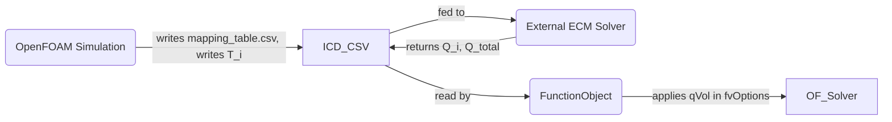

# STAR-CCM+ Migration Plan (OpenFOAM ECM Coupling)

## Executive Summary
We will develop a one-month migration plan to port the OpenFOAM-based
ECM-CHT prototype to an equivalent implementation in Simcenter STAR-CCM+.
The frozen coupling contract from OpenFOAM stays unchanged:
- keyMode = elementID (globalCellID only for OpenFOAM debug)
- fixed Nr x Nz partition
- mapping_table.csv format
- volume-weighted element temperature averaging
- uniform volumetric heat injection
- per-step coupling with under-relaxation alpha
- consistent logging fields: T_i, qVol_i, V, SOC, Q_total

The plan inventories the OpenFOAM artifacts to port, maps each construct to
its STAR-CCM+ equivalent, and provides concrete translation recipes (macro
pseudocode) for each coupling operation. We also include geometry/partition
rebuild guidance, a validation plan for parity of T_i, qVol_i, V, SOC, Q_total,
and a risk register covering ID stability, I/O atomicity, MPI differences, and
performance. A one-month timeline (mermaid Gantt) and required client inputs
are included.

## Concepts and Terminology
- Battery cell: physical electrochemical unit represented by the ECM.
- Mesh cell: OpenFOAM finite-volume cell.
- Coupling exchanges T_mesh[i] and qVol[i] per mesh cell inside a cellZone.
- ECM is not one instance per mesh cell; it is one black box per battery cell
  or module and may return a spatial heat distribution.

## Inventory of OpenFOAM Artifacts to Port
- Case directory layout: constant/, system/, 0/. Preserve physics and BCs.
- Mesh via snappyHexMesh: triSurface, snappyHexMeshDict, setsToZones.
- CellZones: one per electro-thermal element; stored in cellZones file.
- mapping_table.csv: elementID, regionName, cellZoneName, V, centroid.
- FunctionObject ecmCoupler: volumeAverage(T), ICD I/O, ECM call, qVol update,
  under-relaxation, logging. Uses master gather + broadcast MPI strategy.
- fvOptions: ecmQdot scalarSource for volumetric heat injection.
- controlDict coupling cadence and alpha.
- Logs: T_i, qVol_i, V, SOC, Q_total (plus checks).

## STAR-CCM+ Equivalents
- cellZones -> Regions or Volume Parts (Derived Parts)
- mapping_table.csv -> macro-loaded elementID mapping
- volumeAverage(T) -> VolumeAverageReport per element part
- ecmCoupler -> Java/Jython macro (ICD write/read, ECM call, under-relaxation)
- fvOptions heat source -> Volumetric heat source on each element part
- masterGather -> macro I/O on master rank with MPI barrier

## Translation Recipes (Coupling Operations)

### Temperature averaging (T_i)
OpenFOAM computes sum(T*V)/sum(V). In STAR-CCM+ use a VolumeAverageReport
per element part:

```java
VolumeAverageReport avg = sim.getReportManager()
    .createReport("VolumeAverage", "VolAvg_elem_" + elemId);
avg.getInputParts().setObjects(elementPart);
avg.setFieldFunction(sim.getFieldFunctionManager().getFunction("Temperature"));
double Teff = avg.getValue();
```

### Mapping table and elementID
Read mapping_table.csv, map elementID -> regionName, store element volume.

```java
BufferedReader br = new BufferedReader(new FileReader("mapping_table.csv"));
String line;
while ((line = br.readLine()) != null) {
    String[] cols = line.split(",");
    int elem = Integer.parseInt(cols[0]);
    String regionName = cols[1];
    double vol = Double.parseDouble(cols[3]);
    elementRegion.put(elem, regionName);
    elementVolume.put(elem, vol);
}
```

### Binary ICD I/O (tmp + rename)
Use DataOutputStream/DataInputStream for binary files. Write to tmp then rename
for atomicity, matching the OpenFOAM ICD schema (magic, fileType, version, N,
 time, deltaT, keyMode, nInputs, followed by records).

```java
File tmp = new File("ecm_in.tmp");
DataOutputStream out = new DataOutputStream(new FileOutputStream(tmp));
// write header fields and records
out.close();
Files.move(tmp.toPath(), Paths.get("ecm_in.bin"), REPLACE_EXISTING);
```

### ECM invocation
Use Runtime.exec() and wait for completion. Only rank 0 should perform I/O.

```java
if (sim.getMPI().getRank() == 0) {
    Process p = Runtime.getRuntime().exec("/path/to/ecm args");
    p.waitFor();
}
sim.getMPI().barrier();
```

### Heat distribution (qVol_i)
Convert total Q_i to volumetric if needed, then assign per element part.

```java
double qvol = Q[i] / elementVolume.get(elemId);
```

### Under-relaxation (alpha)
Apply in macro; preserve qVol_old across steps.

```java
double qrelaxed = alpha * qnew + (1.0 - alpha) * qold;
qold = qrelaxed;
```

### Apply heat sources
Set volumetric heat source profiles per element part.

```java
Region region = sim.getRegionManager().getRegion(regionName);
// Create or fetch Energy Source and apply qVol profile
```

### Logging
Write CSV lines each time step: time, deltaT, V, SOC, Q_total, T_i, qVol_i.
Ensure column naming matches OpenFOAM logs.

## Geometry and Partition Parity (Nr x Nz)
- Import or recreate jelly-roll, casing, cap, fluid parts.
- Partition jelly-roll into Nr x Nz derived parts using axial planes (z slices)
  and radial cuts (r bands). Use expression-based selection if needed.
- Name parts consistently (e.g., jellyRoll_R0_Z0) and map via mapping_table.csv.
- Validate volumes and centroids against mapping_table.csv.

## Testing and Validation Matrix
1) Unit tests (OpenFOAM baseline): confirm logs and mapping_table outputs.
2) Unit tests (STAR-CCM+): mapping_table volume check, uniform T check,
   known heat source response.
3) Integration tests: parity of T_i, qVol_i, V, SOC, Q_total vs OpenFOAM.
4) CHT parity: compare temperature fields for equivalent BCs.

Acceptance criteria (initial):
- |T_STAR - T_OF| < 1e-6 K for parity tests
- qVol parity within numerical tolerance
- Sum(qVol_i * V_i) equals Q_total (mod relaxation)

## Risk Register
- ElementID stability: rely on external mapping_table, not internal IDs.
- File I/O atomicity: tmp + rename, master-only I/O with barrier.
- MPI differences: only master performs I/O; broadcast results.
- Mesh discrepancies: validate volumes/centroids; adjust meshing.
- Performance: keep coupling cost bounded (I/O, ECM calls).

## One-Month Timeline and Deliverables
```mermaid
timeline
    title Migration Project Timeline (4 Weeks)
    section Week 1: Setup & Inventory
      Finalize geometry & element spec : Done, Tue (W1)
      Prepare STAR-CCM+ environment & example case : Wed (W1)
      Implement mapping_table reader & region setup : Fri (W1)
    section Week 2: Coupling Core
      Develop temperature averaging macro : Mon (W2)
      Implement ECM I/O (ICD write/read) in macro : Wed (W2)
      Code under-relaxation logic & heat source assignment : Fri (W2)
      Unit test macro on static data : Sun (W2)
    section Week 3: Integration & Testing
      Integrate macro with STAR-CCM+ simulation loop : Tue (W3)
      Run parity tests with OpenFOAM cases (logged comparison) : Thu (W3)
      Debug discrepancies, adjust solver settings : Sat (W3)
    section Week 4: Validation & Wrap-up
      Perform fluid CHT runs (compare T profiles) : Mon (W4)
      Final validation report & logs : Wed (W4)
      Prepare final deliverables & documentation : Fri (W4)
      Client handoff / sign-off meeting : Fri (W4)
```

Deliverables by week:
- W1: STAR-CCM+ case with regions and element partitions; volume check report.
- W2: Macro performing one coupling step + log row.
- W3: Parity test report and discrepancy log (if any).
- W4: CHT validation report and handoff pack.

## Required Client Inputs and Sign-off
- ECM interface and parameter ranges
- Nr and Nz partition specs and elementID ordering
- Thermal properties (k_r, k_z, rho, cp)
- Contact resistances or perfect contact decision
- Boundary conditions for validation
- Coupling parameters (alpha, frequency)
- Validation acceptance thresholds
- Compute resources for STAR-CCM+ runs

## Mapping Table Template
```
elementID,regionName,cellZoneName,Volume_m3,centroid_x,centroid_y,centroid_z
0,jellyRoll_R0_Z0,zone0,1.23e-5,0.0,0.0,0.01
1,jellyRoll_R1_Z0,zone1,1.23e-5,0.0,0.0,0.03
```

## Data Flow (OpenFOAM + STAR-CCM+)


STAR-CCM+ mirrors the same file I/O flow via a macro: load mapping_table.csv,
write ICD input, call ECM, read ICD output, assign qVol, and log.
